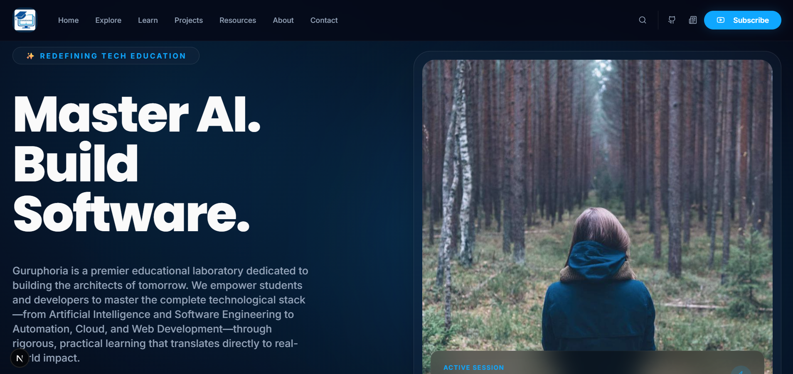
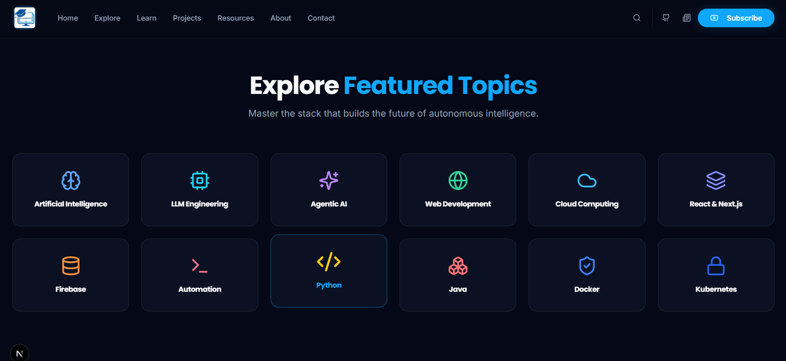

# GuruphoriaHub

GuruphoriaHub is a modern technology education platform built with Next.js, Firebase, and AI-powered recommendations. The app helps learners explore AI, software engineering, cloud, web development, automation, and other emerging technologies through curated content, courses, and project-driven learning.

## Overview

The project is designed to provide a premium learning experience for developers and students who want to build practical skills in the technologies driving the future of software and intelligence.

It includes:

- A polished landing page with a strong educational brand and mission
- Curated course and learning-path discovery
- Resource sections for content from GitHub, YouTube, and Medium
- Firebase-backed app setup for authentication and app data integration
- AI recommendations using Genkit flows for personalized learning suggestions
- Responsive UI built with Next.js and Tailwind CSS

## Tech Stack

- Next.js 15
- React 18
- TypeScript
- Tailwind CSS
- Firebase
- Genkit
- shadcn/ui style components
- Lucide React icons

## Key Features

- Landing page with featured educational content and topic highlights
- Course browsing and course detail experiences
- Dynamic content pulling from external sources and app data
- AI-powered recommendations for curated learning paths
- Responsive design for desktop and mobile experiences
- Clean modern UI with glassmorphism-inspired styling

## Project Structure

```text
src/
  ai/
    dev.ts
    genkit.ts
    flows/
  app/
    ...app routes and pages
  components/
    ...reusable UI and feature components
  firebase/
    ...Firebase client setup and config
  lib/
    ...content fetchers and data models
```

## Getting Started

### 1) Install dependencies

```bash
npm install
```

### 2) Run the development server

```bash
npm run dev
```

The app runs on:

```text
http://localhost:9002
```

### 3) Optional AI dev server

This project includes Genkit flows for AI recommendations. You can run the Genkit local dev server with:

```bash
npm run genkit:dev
```

or watch mode:

```bash
npm run genkit:watch
```

## Available Scripts

```bash
npm run dev          # Start the Next.js app
npm run build        # Production build
npm run start        # Run the production build
npm run lint         # Run Next.js lint checks
npm run typecheck    # TypeScript validation
npm run genkit:dev   # Run Genkit development server
npm run genkit:watch # Watch Genkit flows
```

## Firebase and Configuration

This project includes Firebase configuration and client initialization under the `src/firebase` directory. If you are using your own Firebase project, update the configuration in:

- `src/firebase/config.ts`

## Production Build

```bash
npm run build
```

## Notes

- The project uses app routes and component-based architecture typical of a modern Next.js app.
- The content and recommendation layers are designed to support educational discovery across multiple sources.
- The blueprint and product direction are documented in `docs/blueprint.md`.

## License

This project is currently for educational and portfolio use unless otherwise specified by the repository owner.


